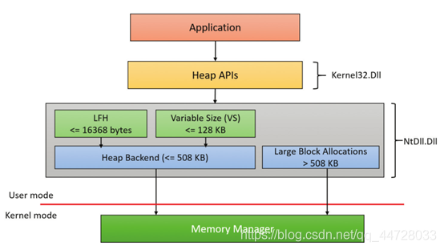
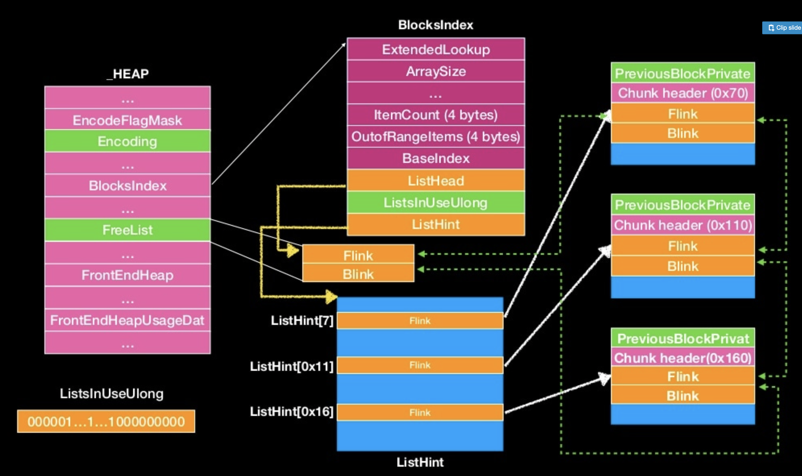
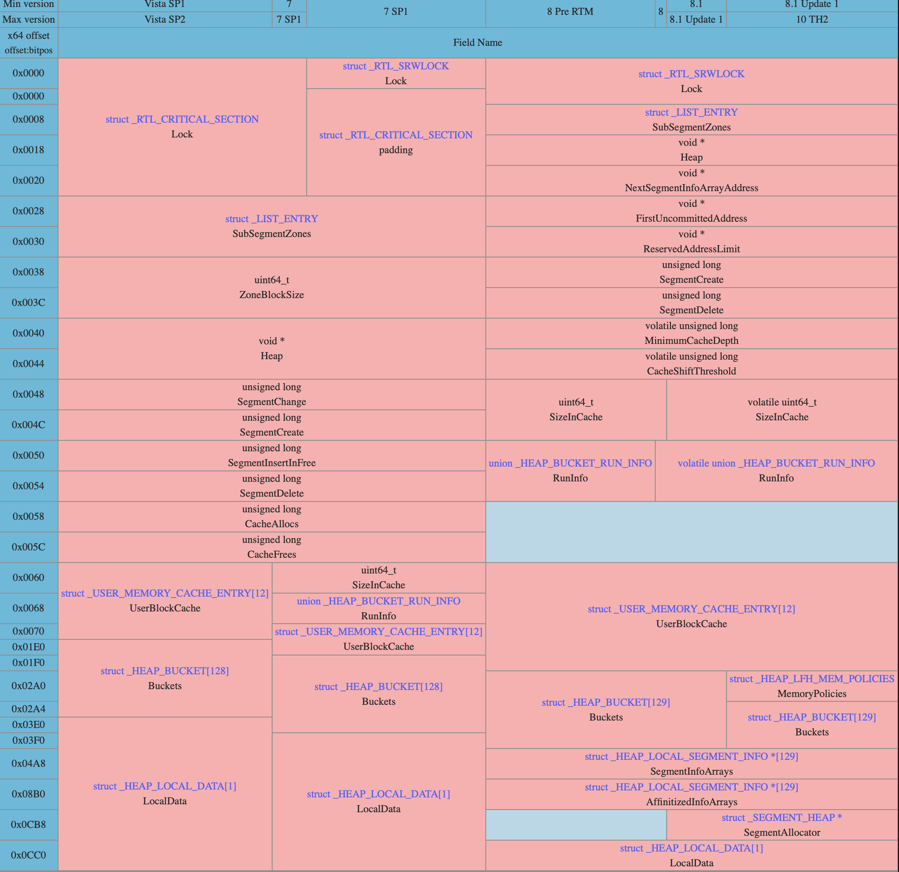
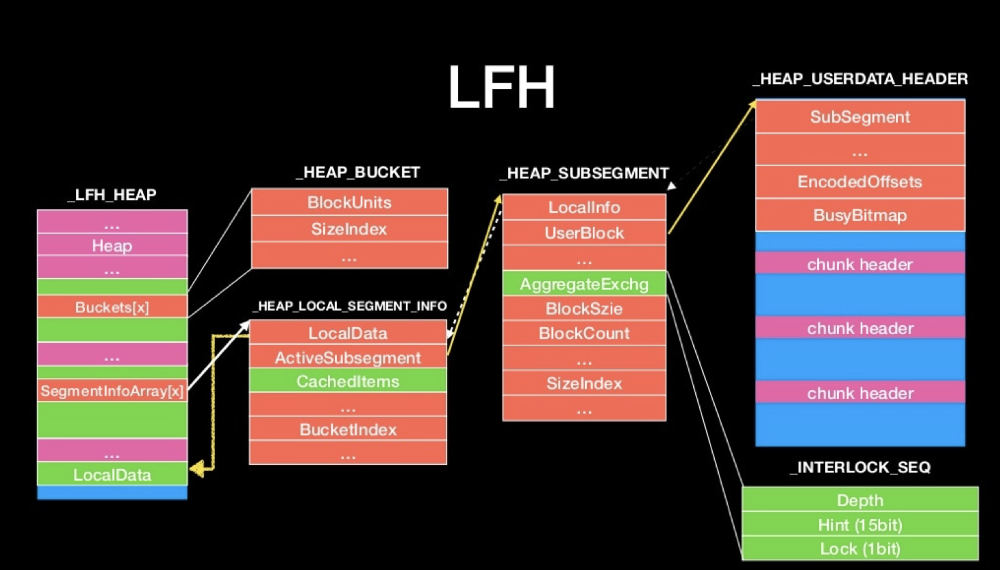

# windows 堆分析

windows和linux堆管理机制虽然呈现给用户的效果是一样的，大体思路也是差不太多，但是底层实现逻辑大相径庭，很多地方和glibc的ptmalloc差别很大。网上资料零零散散，而且都是通过逆向手段分析，所以每个版本资料还多少有些差异，在这里对windows堆管理机制做个归纳，学习一下。

## 接口

在glibc中，通常我们调用的分配函数就是malloc、calloc、realloc，但是这三个函数本质都差不多，本体还是malloc函数的逻辑。

在windows中，堆的分配函数就比较多了这里我们逐一介绍一下。


| 函数原型                                                     | 参数                                                         | 说明                                                         |
| ------------------------------------------------------------ | ------------------------------------------------------------ | ------------------------------------------------------------ |
| HeapAlloc(HANDLE hHeap, DWORD dwFlags, size_t dwSize)        | hHeap为进程堆开始位置，flag就是标志，size就是大小。          | 内存是指定位置开始分配，且分配的内存不可移动。对应的释放函数是HeapFree |
| GlobalAlloc(UINT uFlags, size_t dwBytes)                     | uflag标志信息：GMEM_FIXED分配固定内存，返回一个指针；GMEM_MOVABLE分配活动内存，返回内存对象句柄，这个句柄可以利用GlobalLock转化为指针。 | 从全局堆中分配内存，相应的释放函数是GlobalFree               |
| LocalAlloc(UINT uFlags,size_t dwBytes)                       | 参数同GlobalAlloc                                            | 对应的释放函数为LocalFree                                    |
| VirtualAlloc(LPVOID lpAddress, size_t dwSize,DWORD flAllocationType,DWORD flProtect) | 意义和参数名一样                                             | 对应的释放函数为VirtualFree                                  |
| malloc                                                       | 和linux一样                                                  | free                                                         |
| HeapCreate(DWORD flOptions , DWORD dwInitialSize , DWORD dwMaxmumSize); | flOptions：堆的可选属性。这些标记影响以后对这个堆的函数操作，函数有：HeapAlloc , HeapFree , HeapReAlloc , HeapSize .wInitialSize：堆的初始大小，单位为Bytes。这个值决定了分配给堆的初始物理空间大小。这个值将向上舍入知道下个page boundary（页界）。若需得到主机的页大小，使用GetSystemInfo 函数。dwMaxmumSize：如果该参数是一个非零的值，它指定了这个堆的最大大小，单位为Bytes。 | 用来创造一块堆区域                                           |

从接口信息可以看出来，windows和linux堆的一个很大的不同点就是windows的堆有很多，linux的话都在一个区域里。

另外，globalalloc和localalloc在现代的win32以后的版本中没有区别，这两个函数刚开始是在16位windows中使用有区别的。在win32中每个程序都有一个自己的缺省堆，所以全局堆和局部堆在win32中都指向这个缺省堆，这俩没区别，甚至释放函数都可以混着用。等效于heapAlloc(GetProcessHeap(),flag,size)

malloc函数虽然不像其他的函数那样指明了堆区，但是实际上windows中malloc函数在初始化的时候自己HeapCreate了一段堆内存区域供他使用。每个模块的malloc都有自己的堆区域，所以不能一个dllfree掉另一个dll的堆指针。

## 概览

windows堆管理机制较之于linux比较复杂，管理机制也分好几套。

UWP即Windows通用应用平台，Windows 10中的Universal Windows Platform简称。UWP不同于传统pc上的exe应用，可以在所有Windows10设备上运行。
UWP应用程序进程至少包括三个堆：
（1） 默认堆
（2） 用于向进程的会话Csrss.exe实例传递大参数的共享堆。这是由CsrClientConnectToServer函数创建的，该函数在Ntdll.dll完成的进程初始化早期执行。
（3） 由Microsoft C运行库创建的堆。该堆是由C/C++内存分配函数（如Maloc、Free、等）内部使用的堆。

在Windows10和服务器2016之前，只有一种堆类型，我们称之为NT堆。**Windows 10引入了一种称为段堆（segment heap）的新堆类型**。这两种堆类型包括公共元素，但结构和实现方式不同。默认情况下，**所有UWP应用程序和某些系统进程都使用段堆**，而所有其他进程都使用NT堆。这可以在注册表中更改。

大部分场合默认使用的堆都是`NT heap`，`segment heap`通常会在winapp或者某些特殊的进程（核心进程）中会使用到。

而在NT heap中又分为前端管理和后端管理两套不同的堆分配管理策略。

而windows程序的堆又分为两种：

第一种叫做processheap，它包括两个部分，一个是default heap，其地址信息回存放于_PEB中，在调用malloc等函数的时候会用到。第二个是crtheap，但是其本质一样是default，封装了一些别的信息，存放于crt_heap中。

第二种叫做private heap，也就是我们通过HeapCreate创建的堆。

## NT堆

大体流程



大体流程就是windows app调用msvcrt140.dll函数中的形如malloc、free等函数后，会调用kernel32.dll中的堆管理api，接着调用ntdll中的管理机制。

这里的管理机制中，LFH就是前端管理的核心，那么整个流程具体来说就是如下的逻辑：

> （1） 小于或等于16368字节，使用LFH分配器。这与NT堆的逻辑类似。如果LFH还没有启动，那么将使用可变大小（VS）分配器。
> （2） 对于小于或等于128 KB的大小（不由LFH提供服务），使用VS分配器。VS和LFH分配器都使用后端根据需要创建所需的堆子段。
> （3） 大于128 KB且小于或等于508 KB的分配由堆后端直接提供服务。
> （4） 大于508kb的分配直接调用内存管理器（VirtualAlloc），因为这些分配非常大，因此使用默认的64kb分配粒度（并舍入到最接近的页面大小）就足够了。

如果LFH没有启用，那么就直接调用后端堆管理机制。

启用LFH后，第一次申请或者LFH内部空间不够时会从后端堆中申请一段大空间来使用。

如果LFH搞定了申请，那么直接由LFH返回，不调用后端。

可以看出前端分配器就有点类似于linux中的fastbin。

这里要说明一下，在之前的windows版本中，前端分配器并不是LFH，而是look aside表，也就是0day一书中提到的快表，但是windows10中已经不适用lookaside了。

### 数据结构

由前面的内容可以看出来windows有很多的堆，从linux的管理机制中，我们知道每个堆都由一个重要的数据结构malloc_state来管理，这些个mallocstate就称之为arena，主线程叫main_arena，别的叫thread_arena，这些个数据结构由指针链接形成链表。

那么在windows的堆管理机制中，同样也需要类似于arena这样的结构体。但是不同于linux，每个这样的堆管理结构体是存放于每个堆段的头部，并不是在某些dll的数据段中。

这个数据结构就称之为_HEAP,长这个样子：

```
   +0x000 Segment          : _HEAP_SEGMENT
   +0x000 Entry            : _HEAP_ENTRY
   +0x008 SegmentSignature : Uint4B							//用来判断NT还是Segment
   +0x00c SegmentFlags     : Uint4B
   +0x010 SegmentListEntry : _LIST_ENTRY
   +0x018 Heap             : Ptr32 _HEAP
   +0x01c BaseAddress      : Ptr32 Void
   +0x020 NumberOfPages    : Uint4B
   +0x024 FirstEntry       : Ptr32 _HEAP_ENTRY
   +0x028 LastValidEntry   : Ptr32 _HEAP_ENTRY
   +0x02c NumberOfUnCommittedPages : Uint4B
   +0x030 NumberOfUnCommittedRanges : Uint4B
   +0x034 SegmentAllocatorBackTraceIndex : Uint2B
   +0x036 Reserved         : Uint2B
   +0x038 UCRSegmentList   : _LIST_ENTRY
   +0x040 Flags            : Uint4B
   +0x044 ForceFlags       : Uint4B
   +0x048 CompatibilityFlags : Uint4B
   +0x04c EncodeFlagMask   : Uint4B							//用来表示是否encode header
   +0x050 Encoding         : _HEAP_ENTRY				//用来encode的cookie
   +0x058 Interceptor      : Uint4B
   +0x05c VirtualMemoryThreshold : Uint4B
   +0x060 Signature        : Uint4B
   +0x064 SegmentReserve   : Uint4B
   +0x068 SegmentCommit    : Uint4B
   +0x06c DeCommitFreeBlockThreshold : Uint4B
   +0x070 DeCommitTotalFreeThreshold : Uint4B
   +0x074 TotalFreeSize    : Uint4B
   +0x078 MaximumAllocationSize : Uint4B
   +0x07c ProcessHeapsListIndex : Uint2B
   +0x07e HeaderValidateLength : Uint2B
   +0x080 HeaderValidateCopy : Ptr32 Void
   +0x084 NextAvailableTagIndex : Uint2B
   +0x086 MaximumTagIndex  : Uint2B
   +0x088 TagEntries       : Ptr32 _HEAP_TAG_ENTRY
   +0x08c UCRList          : _LIST_ENTRY
   +0x094 AlignRound       : Uint4B
   +0x098 AlignMask        : Uint4B
   +0x09c VirtualAllocdBlocks : _LIST_ENTRY
   +0x0a4 SegmentList      : _LIST_ENTRY
   +0x0ac AllocatorBackTraceIndex : Uint2B
   +0x0b0 NonDedicatedListLength : Uint4B
   +0x0b4 BlocksIndex      : Ptr32 Void					//用来管理后端的chunk列表
   +0x0b8 UCRIndex         : Ptr32 Void
   +0x0bc PseudoTagEntries : Ptr32 _HEAP_PSEUDO_TAG_ENTRY
   +0x0c0 FreeLists        : _LIST_ENTRY				//用来管理后端所有的freechunk的链表
   +0x0c8 LockVariable     : Ptr32 _HEAP_LOCK
   +0x0cc CommitRoutine    : Ptr32     long 
   +0x0d0 StackTraceInitVar : _RTL_RUN_ONCE
   +0x0d4 CommitLimitData  : _RTL_HEAP_MEMORY_LIMIT_DATA
   +0x0e4 FrontEndHeap     : Ptr32 Void					//指向前端堆的结构
   +0x0e8 FrontHeapLockCount : Uint2B
   +0x0ea FrontEndHeapType : UChar
   +0x0eb RequestedFrontEndHeapType : UChar
   +0x0ec FrontEndHeapUsageData : Ptr32 Wchar		//指向前端管理chunk的列表
   +0x0f0 FrontEndHeapMaximumIndex : Uint2B
   +0x0f2 FrontEndHeapStatusBitmap : [257] UChar
   +0x1f4 Counters         : _HEAP_COUNTERS
   +0x250 TuningParameters : _HEAP_TUNING_PARAMETERS
```

其中比较重要的字段意义都写在了注释中。

在linux中，堆是由一个个chunk构成的，在windows中也一样，也是由一个个堆块构成。

这样一个堆块的结构，称之为_HEAP_ENTRY。这个结构比较奇怪，似乎有好几种实现方式？以为同样偏移有不同的意思。

```
ntdll!_HEAP_ENTRY
   +0x000 UnpackedEntry    : _HEAP_UNPACKED_ENTRY
   +0x000 PreviousBlockPrivateData : Ptr64 Void
   +0x008 Size             : Uint2B
   +0x00a Flags            : UChar
   +0x00b SmallTagIndex    : UChar
   +0x008 SubSegmentCode   : Uint4B
   +0x00c PreviousSize     : Uint2B
   +0x00e SegmentOffset    : UChar
   +0x00e LFHFlags         : UChar
   +0x00f UnusedBytes      : UChar
   +0x008 CompactHeader    : Uint8B
   +0x000 ExtendedEntry    : _HEAP_EXTENDED_ENTRY
   +0x000 Reserved         : Ptr64 Void
   +0x008 FunctionIndex    : Uint2B
   +0x00a ContextValue     : Uint2B
   +0x008 InterceptorValue : Uint4B
   +0x00c UnusedBytesLength : Uint2B
   +0x00e EntryOffset      : UChar
   +0x00f ExtendedBlockSignature : UChar
   +0x000 ReservedForAlignment : Ptr64 Void
   +0x008 Code1            : Uint4B
   +0x00c Code2            : Uint2B
   +0x00e Code3            : UChar
   +0x00f Code4            : UChar
   +0x00c Code234          : Uint4B
   +0x008 AgregateCode     : Uint8B
```

在老外逆出来的c版本中是这样的：

```c
//0x10 bytes (sizeof)
struct _HEAP_ENTRY
{
    union
    {
        struct _HEAP_UNPACKED_ENTRY UnpackedEntry;                          //0x0
        struct
        {
            VOID* PreviousBlockPrivateData;                                 //0x0
            union
            {
                struct
                {
                    USHORT Size;                                            //0x8
                    UCHAR Flags;                                            //0xa
                    UCHAR SmallTagIndex;                                    //0xb
                };
                struct
                {
                    ULONG SubSegmentCode;                                   //0x8
                    USHORT PreviousSize;                                    //0xc
                    union
                    {
                        UCHAR SegmentOffset;                                //0xe
                        UCHAR LFHFlags;                                     //0xe
                    };
                    UCHAR UnusedBytes;                                      //0xf
                };
                ULONGLONG CompactHeader;                                    //0x8
            };
        };
        struct _HEAP_EXTENDED_ENTRY ExtendedEntry;                          //0x0
        struct
        {
            VOID* Reserved;                                                 //0x0
            union
            {
                struct
                {
                    USHORT FunctionIndex;                                   //0x8
                    USHORT ContextValue;                                    //0xa
                };
                ULONG InterceptorValue;                                     //0x8
            };
            USHORT UnusedBytesLength;                                       //0xc
            UCHAR EntryOffset;                                              //0xe
            UCHAR ExtendedBlockSignature;                                   //0xf
        };
        struct
        {
            VOID* ReservedForAlignment;                                     //0x0
            union
            {
                struct
                {
                    ULONG Code1;                                            //0x8
                    union
                    {
                        struct
                        {
                            USHORT Code2;                                   //0xc
                            UCHAR Code3;                                    //0xe
                            UCHAR Code4;                                    //0xf
                        };
                        ULONG Code234;                                      //0xc
                    };
                };
                ULONGLONG AgregateCode;                                     //0x8
            };
        };
    };
}; 
```

这里的话主要是因为一个chunk（也就是_HEAP_ENTRY,这么叫方便些）有不同的状态，所以就union一下。

那么具体来说，一个chunk有三种状态：使用（allocated）、释放（free）、虚拟（virtual alloc）（mmap出来的chunk）。

**使用状态（inuse）：**

| 偏移&名称                     | 大小              | 意义                                                  |
| ----------------------------- | ----------------- | ----------------------------------------------------- |
| 0x0: PreviousBlockPrivateData | 8bytes            | 前一个chunk的数据，由于需要0x10对其所以算在头部       |
| 0x8: Size                     | 2bytes            | 本chunk的大小，这里的大小是 real_size >> 4            |
| 0xa: Flag                     | 1byte             | 表示当前chunk是否inuse                                |
| 0xb: smallTagIndex            | 1byte             | 前三个byte（size和flag）做xor后的值，验证作用         |
| 0xc: PreviousSIze             | 2bytes            | 表示前一个chunk的size，同样也是右移4位后的值          |
| 0xe: SegmentOffset            | 1byte             | 某些情况下用来找segment                               |
| 0xf: UnusedBytes              | 1byte             | 记录malloc后所剩的chunk大小，可用来判断是前端或者后端 |
| 0x10: userdata                | (Size << 4) -0x10 | 用户数据区域                                          |

**释放状态（unused):**

| 偏移&名称                     | 大小   | 意义                                            |
| ----------------------------- | ------ | ----------------------------------------------- |
| 0x0: PreviousBlockPrivateData | 8bytes | 前一个chunk的数据，由于需要0x10对其所以算在头部 |
| 0x8: Size                     | 2bytes | 本chunk的大小，这里的大小是 real_size >> 4      |
| 0xa: Flag                     | 1byte  | 表示当前chunk是否inuse                          |
| 0xb: smallTagIndex            | 1byte  | 前三个byte（size和flag）做xor后的值，验证作用   |
| 0xc: PreviousSIze             | 2bytes | 表示前一个chunk的size，同样也是右移4位后的值    |
| 0xe: SegmentOffset            | 1byte  | 某些情况下用来找segment                         |
| 0xf: UnusedBytes              | 1byte  | 恒为0                                           |
| 0x10:flink                    | 8bytes | 指向list中后一个chunk                           |
| 0x18: blink                   | 8bytes | 指向list中前一个chunk                           |

**virtualAlloc状态：**

| 偏移&名称           | 大小   | 意义                                   |
| ------------------- | ------ | -------------------------------------- |
| 0x0: flink          | 8bytes | 双向链表指针                           |
| 0x8: blink          | 8bytes | 双向链表指针                           |
| 0x10: size          | 2bytes | 这里的size是unusedsize，且没有进行移位 |
| 0x12: flag          | 1byte  |                                        |
| 0x13: smallTagIndex | 1byte  |                                        |
| 0x14: PreviousSIze  | 2bytes |                                        |
| 0x16: SegmentOffset | 1byte  |                                        |
| 0x17:UnusedBytes    | 1byte  | 恒为4                                  |

这里的virtualalloc的chunk状态可能有些勘误，因为网上关于这里的资料比较少。

这里要说明一下，关于chunk头部的验证：

在之前的_HEAP结构体中有一个encoding字段，这个cookie就是为了加密头部来用的，具体来说就是xor一下，所以在对chunk进行操作的时候会验证其有效性。同时SmallTagIndex也会对flag和size做一个验证。

**free_list**

这个是在_HEAP中的一个指针，指向的是free的chunk的链表，双向有序链表。在一个chunk被释放后，会插入到这个list中（类似于unsortedbin）

**BlocksIndex**

这个指针的结构是_HEAP_LIST_LOOKUP。

这一结构体长这个样子：

```c
//0x38 bytes (sizeof)
struct _HEAP_LIST_LOOKUP
{
    struct _HEAP_LIST_LOOKUP* ExtendedLookup;                               //0x0 指向下一个lookup，通常chunk会更大
    ULONG ArraySize;                                                        //0x8 管理的最大chunk大小（右移4位后）
    ULONG ExtraItem;                                                        //0xc
    ULONG ItemCount;                                                        //0x10 当前管理的chunk数
    ULONG OutOfRangeItems;                                                  //0x14 超出该结构体管理的chunk数量
    ULONG BaseIndex;                                                        //0x18 该结构管理的chunk的起始index（listhint中）
    struct _LIST_ENTRY* ListHead;                                           //0x20 指向freelist的head
    ULONG* ListsInUseUlong;                                                 //0x28 判断listhint中是否有合适大小的chunk， 是一个bitmap
    struct _LIST_ENTRY** ListHints;                                         //0x30 用来指向对应大小chunk的array，0x10递增
}; 
```

这两个链表之间的关系如下图（摘自angelboy的slide）



可以看到，所有的chunk都是存储在freelist中，而blockindex用来定位这些在freelist中的chunk的位置，快速找到合适大小的chunk。

### NT后端管理机制

管理机制无非就是申请和释放的逻辑。

#### 申请

申请时，分为三种情况：

```
1.Size<=0x4000
2.0x4000<size<=0xff000
3.Size>0xff000
```

**第一种情况，当size<=0x4000时：**
1.查看size对应到的FrontEndHeapStatusBitmap使否有启用LFH
如果有的话会对对应到的FrontEndHeapUsageData加上0x21，并且检查值是否超过0xff00或者 &0x1f 后超过0x10 : 超过则启用LFH。

2.接下来首先查看对应的ListHint中是否有chunk，有则优先分配（先看快表）
如果有大小合适的chunk在ListHint上则移除ListHint，并且查看chunk的Flink⼤⼩是否size与此chunk相同(注意FreeLists按大小排序)：
为空则清空，否则将LintHint填上Flink。
最后unlink该chunk，把此chunk从linkedlist中移除返回给user，并将header xor回去(返回时header被encode)

3: 若没有大小合适的chunk: 则从比较⼤的ListHint中找，有找到比较大的chunk后，同样查看下⼀块chunk的size是不是一样大小，有则填上，并且unlink该chunk, 从freelist移除。最后将chunk做切割，剩下的⼤⼩重新加入Freelist，如果可以放进ListHint就会放进去，将切割好的chunk返回给使用者(chunk header同样encode)

4.如果FreeList中没有可以操作的chunk，则尝试ExtendHeap来加大heap空间，再从extend出来的heap取chunk，接着像上面一样分割返回(chunk header encode)，剩下的放回ListHint

**第二种情况，当0x4000<size<=0xff000**

基本和第一种情况差不多，但是没有LFH操作。

**第三种情况，当size大于0xff000**

直接使⽤ZwAllocateVirtualMemory，类似直接mmap一大块空间，并且会插入到_HEAP->VirtualAllocdBlocks这个linked list中(这个linked list用来串接该HeapVirtualAllocate出来的区段)

#### 释放

分两种情况，大于小于0xff000分别讨论

**size<=0xff000**

1：首先检查alignment，利⽤unusedbyte判断该chunk状态
如果是非LFH模式下，会对对应到的FrontEndHeapUsageData减1
2：接下来会判断前后的chunk是否为freed，是的话就合并
此时会把可以合并的chunk unlink，并从ListHint移除(移除⽅式与前⾯相同，查看下一个chunk是不是相同⼤⼩，是则补上ListHint)
3：合并之后，update size&prevsize，然后查看是不是最前跟最后，是就插入，否则就从ListHint中插入，并且update ListHint，插入 时也会对linked list进行检查(此检查不会abort，其原因主要是因为不做unlink写入)

具体的流程可以参考angelboy的slide。

**size > 0xff000**

检查该chunk的linkedlist并从_HEAP->VirtualAllocdBlocks移除
接着使⽤RtlpSecMemFreeVirtualMemory将chunk整个munmap掉

### NT前端管理机制

也就是之前一直提到的LFH（low fragment heap），在win10主要使用，只有在非调试状态下才会启用，根据之前的内容也不难推测，是用来管理大小小于0x4000的chunk的。

要想触发LFH，需要分配18个相同大小的堆块，他们可以不连续。

如何查看LFH是否开启呢？在windbg中，可以通过`dt _HEAP [Heap Address]`查看heap结构体，在偏移0x0d6处FrontEndHeapType字段可以揭示是否开启了LFH，如果为0则说明后端堆在管理，为1就是lookaside策略，2就说明是LFH。

另一种方式可以查看一个chunk是否属于LFH管理，通过`!heap -x [Chunk Address]`来查看

#### 数据结构

相关的重要的数据结构为_LFH_HEAP，在 _HEAP结构中，frontEndHeap指针指向这一结构。

这个结构的话不同版本windows还不一样，贴个图：



这里看win10的就可以

```
0:001> dt _LFH_HEAP
ntdll!_LFH_HEAP
   +0x000 Lock             : _RTL_SRWLOCK
   +0x008 SubSegmentZones  : _LIST_ENTRY
   +0x018 Heap             : Ptr64 Void										//指向对应的_HEAP
   +0x020 NextSegmentInfoArrayAddress : Ptr64 Void
   +0x028 FirstUncommittedAddress : Ptr64 Void
   +0x030 ReservedAddressLimit : Ptr64 Void
   +0x038 SegmentCreate    : Uint4B
   +0x03c SegmentDelete    : Uint4B
   +0x040 MinimumCacheDepth : Uint4B
   +0x044 CacheShiftThreshold : Uint4B
   +0x048 SizeInCache      : Uint8B
   +0x050 RunInfo          : _HEAP_BUCKET_RUN_INFO
   +0x060 UserBlockCache   : [12] _USER_MEMORY_CACHE_ENTRY
   +0x2a0 MemoryPolicies   : _HEAP_LFH_MEM_POLICIES
   +0x2a4 Buckets          : [129] _HEAP_BUCKET						//用来寻找配置⼤⼩对应到 Block ⼤⼩的阵列
   +0x4a8 SegmentInfoArrays : [129] Ptr64 _HEAP_LOCAL_SEGMENT_INFO			//不同大小对应到不同的segmentinfo结构，主要管理对应的subsegment的信息
   +0x8b0 AffinitizedInfoArrays : [129] Ptr64 _HEAP_LOCAL_SEGMENT_INFO
   +0xcb8 SegmentAllocator : Ptr64 _SEGMENT_HEAP
   +0xcc0 LocalData        : [1] _HEAP_LOCAL_DATA							//其中有个地址指向LFH本身，用来找回LFH
```

可以看到这结构体类似于_HEAP,包含了很多指针信息，这其中又有两个结构体需要分析一下。

_HEAP_BUCKET

```
ntdll!_HEAP_BUCKET
   +0x000 BlockUnits       : Uint2B					//分配block大小>>4
   +0x002 SizeIndex        : UChar					//使用大小>>4
   +0x003 UseAffinity      : Pos 0, 1 Bit
   +0x003 DebugFlags       : Pos 1, 2 Bits
   +0x003 Flags            : UChar
```

_HEAP_LOCAL_SEGMENT_INFO

```
ntdll!_HEAP_LOCAL_SEGMENT_INFO
   +0x000 LocalData        : Ptr64 _HEAP_LOCAL_DATA	//对应 _LFH_HEAP->LocalData ，便于从 SegmentInfo 找回 _LFH_HEAP
   +0x008 ActiveSubsegment : Ptr64 _HEAP_SUBSEGMENT	//对应已分配的Subsegment,用于管理userblock记录剩余多少chunk、最大分配书等等
   +0x010 CachedItems      : [16] Ptr64 _HEAP_SUBSEGMENT	//_HEAP_SUBSEGMENT array
																												//存放对应此SegmentInfo且还有可以分配chunk给user的Subsegment 
																								//当ActiveSubsegment⽤完时，将从这里填充，并置换掉ActiveSubsegment
   +0x090 SListHeader      : _SLIST_HEADER
   +0x0a0 Counters         : _HEAP_BUCKET_COUNTERS
   +0x0a8 LastOpSequence   : Uint4B
   +0x0ac BucketIndex      : Uint2B
   +0x0ae LastUsed         : Uint2B
   +0x0b0 NoThrashCount    : Uint2B
```

其中，cachedItems比较重要，其结构体为_HEAP_SUBSEGMENT:

```
ntdll!_HEAP_SUBSEGMENT
   +0x000 LocalInfo        : Ptr64 _HEAP_LOCAL_SEGMENT_INFO	//指向对应的_HEAP_LOCAL_SEGMENT_INFO
   +0x008 UserBlocks       : Ptr64 _HEAP_USERDATA_HEADER		//记录要分配出去的chunk所在位置，开头存储一些metadata来管理这些chunk
   +0x010 DelayFreeList    : _SLIST_HEADER
   +0x020 AggregateExchg   : _INTERLOCK_SEQ			//用来管理对应的userblock中还有多少freedchunk，LFH以此来判断是否从此userblock中分配
   +0x024 BlockSize        : Uint2B			//此userblock中每个chunk的大小
   +0x026 Flags            : Uint2B
   +0x028 BlockCount       : Uint2B			//此userblock中chunk的总数
   +0x02a SizeIndex        : UChar			//该userblock对应的sizeindex
   +0x02b AffinityIndex    : UChar
   +0x024 Alignment        : [2] Uint4B
   +0x02c Lock             : Uint4B
   +0x030 SFreeListEntry   : _SINGLE_LIST_ENTRY
```

_INTERLOCK_SEQ

```
ntdll!_INTERLOCK_SEQ
   +0x000 Depth            : Uint2B			//该userblock剩余freechunk的数量
   +0x002 Hint             : Pos 0, 15 Bits
   +0x002 Lock             : Pos 15, 1 Bit
   +0x002 Hint16           : Uint2B
   +0x000 Exchg            : Int4B
```

_HEAP_USERDATA_HEADER

```
ntdll!_HEAP_USERDATA_HEADER
   +0x000 SFreeListEntry   : _SINGLE_LIST_ENTRY
   +0x000 SubSegment       : Ptr64 _HEAP_SUBSEGMENT		//指回对应的_HEAP_SUBSEGMENT
   +0x008 Reserved         : Ptr64 Void
   +0x010 SizeIndexAndPadding : Uint4B
   +0x010 SizeIndex        : UChar
   +0x011 GuardPagePresent : UChar
   +0x012 PaddingBytes     : Uint2B
   +0x014 Signature        : Uint4B
   +0x018 EncodedOffsets   : _HEAP_USERDATA_OFFSETS		//用于检查Userdata的头部字段
   +0x020 BusyBitmap       : _RTL_BITMAP_EX			//bitmap，用来记录使用的chunk
   +0x030 BitmapData       : [1] Uint8B
```

其中的EncodingOffset字段就是个验证，在USERBLOCK初始化时会生成这个数值作为验证用，其数值具体来说是以下四个值的xor：

```
(sizeof(userblock header)) | (blockunit*0x10 << 16)
LFHkey
Userblock addr
LFH_HEAP addr
```

在_HEAP_USERDATA_HEADER之后就是一系列的chunks。

在LFH中，chunk虽然还是chunk，但是头部信息和之前学的chunk不一样

| 偏移&名称                     | 大小   | 意义                                            |
| ----------------------------- | ------ | ----------------------------------------------- |
| 0x0: PreviousBlockPrivateData | 8bytes | 前一个chunk的数据，由于需要0x10对其所以算在头部 |
| 0x8: SubSegmentCode           | 4bytes | encode过的metadata，用来推回userblock的位置     |
| 0xc: PreviousSIze             | 2bytes | 该chunk在userblock中的index                     |
| 0xe: SegmentOffset            | 1byte  |                                                 |
| 0xf: UnusedByte               | 1byte  | 恒为0x80，用来判断是否为LFH的freechunk          |
| 0x10: UserData                |        |                                                 |

其中，SubSegmentCode的值为这四个值的xor：

```
_HEAP address
LFHkey
Chunk address >> 4
((chunk address) - (UserBlock address)) << 12
```

搞了这么多结构体，头疼眼晕，好在angelboy大佬给出了LFHheap的overview：



#### 管理机制

在之前的后端管理逻辑中已经对LFH这一概念有所提及。

**申请**

LFH涉及到初始化工作，具体来说就是查看size对应到的FrontEndHeapStatusBitmap使否有启用LFH
如果有的话会对对应到的FrontEndHeapUsageData加上0x21，并且检查值是否超过0xff00或者 &0x1f 后超过0x10 : 超过则启用LFH。也就是在`FrontEndHeapUsageData[x] & 0x1F > 0x10`的时候，置位`_HEAP->CompatibilityFlag |= 0x20000000`，下一次`Allocate`就会对LFH进行初始化：

1. 首先会ExtendFrontENdUsageData，也就是将这个数值增大，然后增加更大的_HEAP->BlocksIndex,因为这里`_HEAP->BlocksIndex`可以理解为一个`_HEAP_LIST_LOOKUP`结构的单向链表（参考上面Back-End的解释），且默认初始情况下只存在一个管理比较小的（0x0 ~ 0x80）的chunk的`_HEAP_LIST_LOOKUP`，所以这里会扩展到（0x80 ~ 0x400），即在链表尾追加一个管理更大chunk的`_HEAP_LIST_LOOKUP`结构体结点。

   ```
   在 FrontEndHeapUsageData 写上对应的index，此时 enable LFH 范围变为 (idx: 0-0x400)
   FrontEndHeapUsageData中分为两部分：对应用于判断LFH是否需要初始化的map以及已经enable LFH的chunk size (例如enable malloc 0x50大小的chunk，则写入0x50>>4=5)
    原BlocksIndex进行扩展，即新建一个BlocksIndex，写入原BlocksIndex->ExtendedLookup，进行扩展
   ```

   

2. 建立并初始化`_HEAP->FrontEndHeap`（通过`mmap`），即初始化`_LFH_HEAP`的一些metadata。

3. 建立并初始化`_LFH_HEAP->SegmentInfoArrays[x]`，在`SegmentInfoArrays[BucketIndex]`处填上对应的`_HEAP_LOCAL_SEGMENT_INFO`结构体指针。

在初始化后，从LFH分配内存的逻辑为：

1.先看ActiveSubSegment中是否有可以分配的chunk，这个是否有的判断标准就是ActiveSubSegment->AggregateExchg->depth

2.如果没有就从CachedItem中找，找到的话会把ActiveSubSegment换成CachedItem中的SubSegment

到了这一步时，LFH分配器就找到了UserBlock，UserBlock中有很多的chunk可以供用户使用，LFH选取chunk的标准如下：

1.首先从RtlpLowFragHeapRandomData中下标为x处取一个值，这个名字很长的数组是一个长度为256byte的元素大小范围为0-0x7f的随机数数组，每次取，x都会自增1，如果x超过了256，那么x = rand()%256.

2.最终获取的index为RtlLowFragHeapRandomData[x]*maxidx >> 7,检查bitmap是否为0，如果冲突了的话就往后找最近的

3.检查(unused byte & 0x3f)!=0(表示chunk是free的)

4.最后设置index（chunk头部中的previoussize）和unusedbyte返回给用户。

**释放**

1.将unused位改成0x80

2.根据头部中的字段找到userblock，然后找会Subsegment，根据index设置bitmap

3.更新ActiveSubSegment->AggregateExchg

4.如果释放的chunk不属于当前的ActiveSubSegment就看一下能不能放到cachedItems中，可以就放进去。

## 利用方式

### 地址问题

先不考虑如何利用的事，首先关注最基本的问题，要泄漏什么地址？地址在哪？

假设我们有了任意内存地址读写，那么我们就需要泄漏一些关键的函数地址，比如说system，以及攻击的目标点，比如栈地址。

不同于linux，windows有一堆dll函数库。

这里，根据angelboy的slide，需要泄漏的地址为kernelbase以及stackaddress，这两个地址在kernel32.dll。

那么如何泄漏ntdll呢？_HEAP_LOCK相关的信息会指向ntdll，具体来说，就是\_HEAP->LockVariable.Lock以及CriticalSection->DebugInfo

在ntdll!PebLdr中，_PEB_LDR_DATA可以找到所有dll的位置。

同样可以从IAT表中找到kernel32，不过需要先泄漏binary的地址。

在KERNELBASE!BasepFilterInfo中，会有大概率包含stack的指针，这个主要是因为内存没有初始化。

如果这个上面没有想要的地址，可以从PEB向后算一个page，通常会是TEB上，这上面也会有stack的地址信息。

攻击的话，angelboy提出的方式就是泄漏地址，然后攻击栈写rop或者shellcode。

### 后端利用方式

#### unlink

和linux中的unlink很像（都是双向链表的节点移除），但是绕过条件和linux不同，因为头部的信息不同，需要对一些encode的字段构造一下。还有就是flink和blink指向的是userdata部分。

具体构造就是p -> fd = &p-8, p->bk = &p.

### 前端利用方式

angelboy同样是只是草草的介绍了下如果有了uaf的话，如何绕过随机在LFHuserblock中分配到指定chunk的方式，具体来说就是填满其他的，下一次肯定就会落到目标点。那么有了uaf之后呢，劫持哪些指针劫持到哪里并没有说明。所以这里的话还需要后续调试的时候整理。

### 具体怎么攻击才叫合理？哪些攻击面呢？

由于Angelboy给的利用方式太少，而且比较笼统局限，所以我又参考了别的资料，想找到一些类似于linux堆利用手法的攻击方式。

然而现实打了我一巴掌，根据冠城大佬的ppt，在windows中，想通过攻击堆的头部或者其他字段来进行getshell几乎不可能，因为windows堆的防御机制十分严格。堆中比较合理的攻击手法似乎就只有unlink或者其他形式的修改函数指针的方式。

