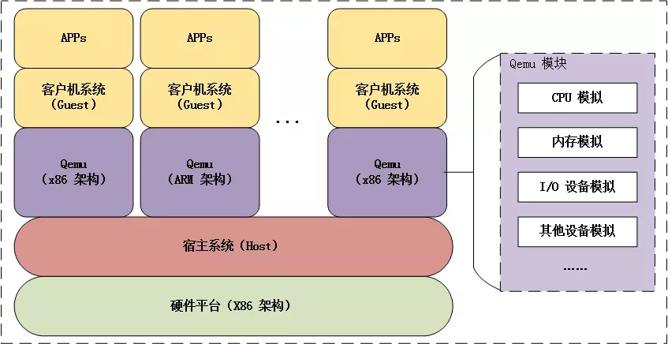
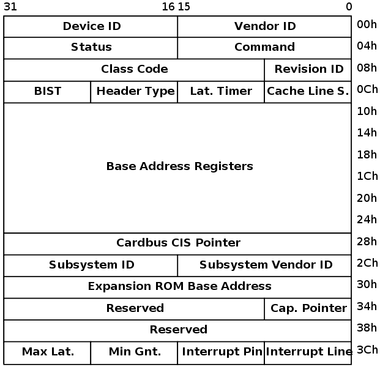
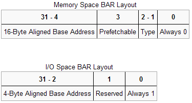

# qemu 逃逸学习笔记

### 什么是QEMU

QEMU是一种通用的开源计算机仿真器和虚拟器。QEMU共有两种操作模式

全系统仿真：能够在任意支持的架构上为任何机器运行一个完整的操作系统

用户模式仿真：能够在任意支持的架构上为另一个Linux/BSD运行程序。

同时当进行虚拟化时，QEMU也可以以接近本机的性能运行KVM或者Xen。

当QEMU用作虚拟器时，QEMU的优点在于其实纯软件实现的虚拟化模拟器，几乎可以模拟任何硬件设备，但是也正因为QEMU是纯软件实现的，因此所有指令都需要QEMU转手，因此会严重的降低性能。而可行的办法是通过配合KVM或者Xen来进行加速，目前肯定是以KVM为主。KVM 是硬件辅助的虚拟化技术，主要负责 比较繁琐的 CPU 和内存虚拟化，而 QEMU 则负责 I/O 虚拟化，两者合作各自发挥自身的优势，相得益彰。



从本质上看，虚拟出的每个虚拟机对应 host 上的一个 Qemu 进程，而虚拟机的执行线程（如 CPU 线程、I/O 线程等）对应 Qemu 进程的一个线程。

### 内存布局

在虚拟机中不论是kvm还是qemu有几个关键的地址。

GVA：guest virtual address（虚拟机中的虚拟地址）

GPA：guest physical address（虚拟机中的物理地址）

HVA：host virtual address（宿主机中的虚拟地址）

HPA： host physical address（宿主机中的物理地址）

```
                        Guest' processes
                     +--------------------+
Virtual addr space   |                    |
                     +--------------------+                                    （GVA）
                     |                    |
                     \__   Page Table     \__
                        \                    \
                         |                    |  Guest kernel
                    +----+--------------------+----------------+
Guest's phy. memory |    |                    |                |            （GPA）
                    +----+--------------------+----------------+
                    |                                          |
                    \__                                        \__
                       \                                          \
                        |             QEMU process                 |
                   +----+------------------------------------------+
Virtual addr space |    |                                          |         （HVA）
                   +----+------------------------------------------+
                   |                                               |
                    \__                Page Table                   \__
                       \                                               \
                        |                                               |
                   +----+-----------------------------------------------++
Physical memory    |    |                                               ||    （HPA）
                   +----+-----------------------------------------------++
```

这个地址转换的页表信息可以从/proc/self/pagemap这一文件中找到。好在前辈已经写好了脚本供我们使用。

在虚拟机中运行即可找到相应的地址信息。

```c
#include <stdio.h>
#include <string.h>
#include <stdint.h>
#include <stdlib.h>
#include <fcntl.h>
#include <assert.h>
#include <inttypes.h>

#define PAGE_SHIFT  12
#define PAGE_SIZE   (1 << PAGE_SHIFT)
#define PFN_PRESENT (1ull << 63)
#define PFN_PFN     ((1ull << 55) - 1)

int fd;

uint32_t page_offset(uint32_t addr)
{
    return addr & ((1 << PAGE_SHIFT) - 1);
}

uint64_t gva_to_gfn(void *addr)
{
    uint64_t pme, gfn;
    size_t offset;
    offset = ((uintptr_t)addr >> 9) & ~7;
    lseek(fd, offset, SEEK_SET);
    read(fd, &pme, 8);
    if (!(pme & PFN_PRESENT))
        return -1;
    gfn = pme & PFN_PFN;
    return gfn;
}

uint64_t gva_to_gpa(void *addr)
{
    uint64_t gfn = gva_to_gfn(addr);
    assert(gfn != -1);
    return (gfn << PAGE_SHIFT) | page_offset((uint64_t)addr);
}

int main()
{
    uint8_t *ptr;
    uint64_t ptr_mem;
    
    fd = open("/proc/self/pagemap", O_RDONLY);
    if (fd < 0) {
        perror("open");
        exit(1);
    }
    
    ptr = malloc(256);
    strcpy(ptr, "Where am I?");
    printf("%s\n", ptr);
    ptr_mem = gva_to_gpa(ptr);
    printf("Your physical address is at 0x%"PRIx64"\n", ptr_mem);

    getchar();
    return 0;
}
```

### 启动相关

qemu逃逸相关的题目都会给各个选手一个启动脚本，这个启动脚本里面包含了很多有用的信息，以经典题目strng为例，它的启动脚本为：

```bash
./qemu-system-x86_64 \
    -m 1G \
    -device strng \
    -hda my-disk.img \
    -hdb my-seed.img \
    -nographic \
    -L pc-bios/ \
    -enable-kvm \
    -device e1000,netdev=net0 \
    -netdev user,id=net0,hostfwd=tcp::5555-:22
```

device代表要挂载的设备，通常qemu逃逸的题目都是和这个设备有关。

其他的选项也代表了其他的启动选项，具体的可以看这个链接：

https://documentation.suse.com/zh-cn/sles/15-SP2/html/SLES-all/cha-qemu-running.html

另外注意一点是，这道题没有加monitor选项（ -monitor /dev/null），这样会造成非预期。

首先ctrl+a 然后输入c回车之后即可进入monitor模式，然后就可以为所欲为了，可以用migrate来执行命令读取flag

```bash
migrate "exec:cat flag 1>&2"
```

### PCI设备

首先明确一个概念，PCI全称即Periheral Component Interconnect，也就是计算机的总线，计算机通过这一根总线连接各种各样的设备。而PCI这个东西，对于linux内核来说也算是一个设备，linux内核中内置了PCI的驱动。而连接在PCI上面的其他设备，也需要编写驱动来进行访问，这一逻辑在这篇文章中有比较清晰的阐述：https://zhuanlan.zhihu.com/p/53957763

在linux内核pwn中，出问题的可能是一些驱动模块，我们通过攻击这些模块来进行提权等等目的。而在qemu逃逸中，我们攻击的是一些PCI设备，虚拟机通过MMIO或者PCIO的方式访问操控这些设备，进而达到攻击的目的。

这里我在学习的时候就有些搞不清楚这个PCI设备和驱动的逻辑，其实他们的逻辑是这样的：PCI和驱动程序等等一系列的概念是计算机本身有的东西，而PCIO和MMIO这些逻辑本身是设备的功能逻辑，由于qemu把这些硬件逻辑信息都用软件进行了实现，所以可能会搞混。

PCI设备都有一个配置空间（PCI Configuration Space），其记录了关于此设备的详细信息。大小为256字节，其中头部64字节是PCI标准规定的，当然并非所有的项都必须填充，位置是固定了，没有用到可以填充0。前16个字节的格式是一定的，包含头部的类型、设备的总类、设备的性质以及制造商等，格式如下：



其中6个BAR（Base Address Register）比较重要，BAR记录了设备所需要的地址空间的类型，基址以及其他属性。



设备可以申请两类地址空间，memory space和I/O space，它们用BAR的最后一位区别开来。

当BAR最后一位为0表示这是映射的I/O内存，为1是表示这是I/O端口，当是I/O内存的时候1-2位表示内存的类型，bit 2为1表示采用64位地址，为0表示采用32位地址。bit1为1表示区间大小超过1M，为0表示不超过1M。bit3表示是否支持可预取。

而相对于I/O内存，当最后一位为1时表示映射的I/O端口。I/O端口一般不支持预取，所以这里是29位的地址。

通过memory space访问设备I/O的方式称为memory mapped I/O，即MMIO，这种情况下，CPU直接使用普通访存指令即可访问设备I/O。

通过I/O space访问设备I/O的方式称为port I/O，或者port mapped I/O，这种情况下CPU需要使用专门的I/O指令如`IN/OUT`访问I/O端口。

在MMIO中，内存和I/O设备共享同一个地址空间。 MMIO是应用得最为广泛的一种I/O方法，它使用相同的地址总线来处理内存和I/O设备，I/O设备的内存和寄存器被映射到与之相关联的地址。当CPU访问某个内存地址时，它可能是物理内存，也可以是某个I/O设备的内存，用于访问内存的CPU指令也可来访问I/O设备。每个I/O设备监视CPU的地址总线，一旦CPU访问分配给它的地址，它就做出响应，将数据总线连接到需要访问的设备硬件寄存器。为了容纳I/O设备，CPU必须预留给I/O一个地址区域，该地址区域不能给物理内存使用。

在PMIO中，内存和I/O设备有各自的地址空间。 端口映射I/O通常使用一种特殊的CPU指令，专门执行I/O操作。在Intel的微处理器中，使用的指令是IN和OUT。这些指令可以读/写1,2,4个字节（例如：`outb`, `outw`, `outl`）到IO设备上。I/O设备有一个与内存不同的地址空间，为了实现地址空间的隔离，要么在CPU物理接口上增加一个I/O引脚，要么增加一条专用的I/O总线。由于I/O地址空间与内存地址空间是隔离的，所以有时将PMIO称为被隔离的IO(Isolated I/O)。

#### 查看PCI设备

使用lspci命令即可查看所有PCI设备信息

```
00:00.0 Host bridge: Intel Corporation 82P965/G965 Memory Controller Hub (rev 02)
00:01.0 PCI bridge: Intel Corporation 82G35 Express PCI Express Root Port (rev 02)
00:03.0 Unassigned class [ff00]: Parallels, Inc. Virtual Machine Communication Interface
00:05.0 Ethernet controller: Red Hat, Inc. Virtio network device
00:0a.0 PCI bridge: Digital Equipment Corporation DECchip 21150
00:0e.0 RAM memory: Red Hat, Inc. Virtio memory balloon
00:1d.0 USB controller: Intel Corporation 82801FB/FBM/FR/FW/FRW (ICH6 Family) USB UHCI #1 (rev 02)
00:1d.6 USB controller: NEC Corporation uPD720200 USB 3.0 Host Controller (rev 04)
00:1d.7 USB controller: Intel Corporation 82801FB/FBM/FR/FW/FRW (ICH6 Family) USB2 EHCI Controller (rev 02)
00:1e.0 PCI bridge: Intel Corporation 82801 PCI Bridge (rev f2)
00:1f.0 ISA bridge: Intel Corporation 82801HB/HR (ICH8/R) LPC Interface Controller (rev 02)
00:1f.1 IDE interface: Intel Corporation 82801BA IDE U100 Controller (rev 05)
00:1f.2 SATA controller: Intel Corporation 82801HR/HO/HH (ICH8R/DO/DH) 6 port SATA Controller [AHCI mode] (rev 02)
00:1f.3 SMBus: Intel Corporation 82801H (ICH8 Family) SMBus Controller (rev 02)
00:1f.4 Audio device: Intel Corporation 82801I (ICH9 Family) HD Audio Controller
01:00.0 VGA compatible controller: Red Hat, Inc. Virtio GPU (rev 01)

```

这里的pci设备的寻址是由总线、设备以及功能构成，`xx:yy:z`的格式为`总线:设备:功能`的格式。

每个 PCI 设备有一个总线号, 一个设备号, 一个功能号标识。PCI 规范允许单个系统占用多达 256 个总线, 但是因为 256 个总线对许多大系统是不够的, Linux 现在支持 PCI 域。每个 PCI 域可以占用多达 256 个总线. 每个总线占用 32 个设备, 每个设备可以是 一个多功能卡(例如一个声音设备, 带有一个附加的 CD-ROM 驱动)有最多 8 个功能。

PCI 设备通过`VendorIDs`、`DeviceIDs`、以及`Class Codes`字段区分：

```bash
ubuntu@ubuntu:~$ lspci -v -m -n -s 00:03.0
Device: 00:03.0
Class:  00ff
Vendor: 1234
Device: 11e9
SVendor:        1af4
SDevice:        1100
PhySlot:        3
Rev:    10

ubuntu@ubuntu:~$ lspci -v -m -s 00:03.0
Device: 00:03.0
Class:  Unclassified device [00ff]
Vendor: Vendor 1234
Device: Device 11e9
SVendor:        Red Hat, Inc
SDevice:        Device 1100
PhySlot:        3
Rev:    10
```

也可通过查看其`config `文件来查看设备的配置空间，数据都可以匹配上，如前两个字节`1234`为`vendor id`：

```
ubuntu@ubuntu:~$ hexdump /sys/devices/pci0000\:00/0000\:00\:03.0/config
0000000 1234 11e9 0103 0000 0010 00ff 0000 0000
0000010 1000 febf c051 0000 0000 0000 0000 0000
0000020 0000 0000 0000 0000 0000 0000 1af4 1100
0000030 0000 0000 0000 0000 0000 0000 0000 0000
```

查看内存空间

```bash
ubuntu@ubuntu:~$ lspci -v -s 00:03.0 -x
00:03.0 Unclassified device [00ff]: Device 1234:11e9 (rev 10)
        Subsystem: Red Hat, Inc Device 1100
        Physical Slot: 3
        Flags: fast devsel
        Memory at febf1000 (32-bit, non-prefetchable) [size=256]
        I/O ports at c050 [size=8]
00: 34 12 e9 11 03 01 00 00 10 00 ff 00 00 00 00 00
10: 00 10 bf fe 51 c0 00 00 00 00 00 00 00 00 00 00
20: 00 00 00 00 00 00 00 00 00 00 00 00 f4 1a 00 11
30: 00 00 00 00 00 00 00 00 00 00 00 00 00 00 00 00
```

这里的内存空间对应pci设备内存空间一图，前十六个字节代表头部的类型、设备的总类、设备的性质以及制造商等信息。

从第二行开始就是六个BAR，四个字节一组，可以看到第一个BAR最低位为0，是mmio，第二个为PCIO，在之前的命令执行结果的文字中已经有了相关的信息。

同时，可以通过查看设备文件夹中的resource文件来查看地址空间信息。

```
ubuntu@ubuntu:~$ ls -la /sys/devices/pci0000\:00/0000\:00\:03.0/
...
-r--r--r--  1 root root 4096 Aug  1 03:40 resource
-rw-------  1 root root  256 Jul 31 13:18 resource0
-rw-------  1 root root    8 Aug  1 04:01 resource1
...
```

resource为包含其他相应空间的文件，然后从BAR0 - BAR1对应各个resourceX文件。

```
ubuntu@ubuntu:~$ cat /sys/devices/pci0000\:00/0000\:00\:03.0/resource
0x00000000febf1000 0x00000000febf10ff 0x0000000000040200
0x000000000000c050 0x000000000000c057 0x0000000000040101
0x0000000000000000 0x0000000000000000 0x0000000000000000
0x0000000000000000 0x0000000000000000 0x0000000000000000
0x0000000000000000 0x0000000000000000 0x0000000000000000
```

每行分别表示相应空间的起始地址（start-address）、结束地址（end-address）以及标识位（flags）。

#### 编程访问MMIO、PCIO

##### MMIO

在用户态，通过映射相应的resourceX文件来实现MMIO的访问, 以strng题目为例：

```c
#include <assert.h>
#include <fcntl.h>
#include <inttypes.h>
#include <stdio.h>
#include <stdlib.h>
#include <string.h>
#include <sys/mman.h>
#include <sys/types.h>
#include <unistd.h>
#include<sys/io.h>


unsigned char* mmio_mem;

void die(const char* msg)
{
    perror(msg);
    exit(-1);
}


void mmio_write(uint32_t addr, uint32_t value)
{
    *((uint32_t*)(mmio_mem + addr)) = value;
}

uint32_t mmio_read(uint32_t addr)
{
    return *((uint32_t*)(mmio_mem + addr));
}


int main(int argc, char *argv[])
{
    
    // Open and map I/O memory for the strng device
    int mmio_fd = open("/sys/devices/pci0000:00/0000:00:04.0/resource0", O_RDWR | O_SYNC);
    if (mmio_fd == -1)
        die("mmio_fd open failed");

    mmio_mem = mmap(0, 0x1000, PROT_READ | PROT_WRITE, MAP_SHARED, mmio_fd, 0);
    if (mmio_mem == MAP_FAILED)
        die("mmap mmio_mem failed");

    printf("mmio_mem @ %p\n", mmio_mem);
    
    mmio_read(0x128);
    mmio_write(0x128, 1337);

}
```

##### PCIO

用户态可以通过in、out来进行访问

```c
#include <sys/io.h >

iopl(3); // 用户态需要申请
inb(port); 
inw(port); 
inl(port);

outb(val,port); 
outw(val,port); 
outl(val,port);
```

#### QOM

即Qemu Object Module，编写一个qemu虚拟机设备的话都需要用这个编程模型来进行编写。为什么要说这个呢，因为在之后的逆向分析中需要分析相应的设备信息。

QOM是QEMU在C的基础上自己实现的一套面向对象机制，负责将device、bus等设备都抽象成为对象。对象的初始化分为四步：

1. 将 TypeInfo 注册 TypeImpl
2. 实例化 ObjectClass
3. 实例化 Object
4. 添加 Property

经过 class_init 和 instance_init 产生设备对应Object后，这个Object是不能直接使用的。其真正初始化逻辑的大头都放在 realize 中做，比如创建对应的memory region，挂载到对应bus上等等。只有在 realize 后，设备才算真正构造完成，可以拿来用了。

关于QOM，这篇文章介绍的比较详细，可以参考：https://www.binss.me/blog/qemu-note-of-qemu-object-model/

### 如何调试、分析

拿到qemu的时候，首先查看启动脚本的信息，看下设备名以及是否可以非预期。而后启动qemu。

然后丢到ida里面分析，既然是qemu逃逸，那么大概率与其加载的PCI设备有关，所以第一步先搜函数，找到相应的函数，理清相关的逻辑信息。

然后还是和上文提到的一样，看看pci设备的文件。

那么如何调试呢？

这里的话调试qemu可以直接用gdb起，但是通常都是找到其进程号，然后attach上去。

具体来说，` ps -aux | grep qemu `, 找到进程号，attach上去即可。

下断点的话如果没去符号的话直接断在函数名即可。

怎么传exp呢？

可以通过scp的方式将本地编译好的exp发给虚拟机

` scp -P5555 exp ubuntu@127.0.0.1:/home/ubuntu `


### 参考链接

https://www.jianshu.com/p/f08e34cf08ad

https://ray-cp.github.io/archivers/qemu-pwn-basic-knowledge